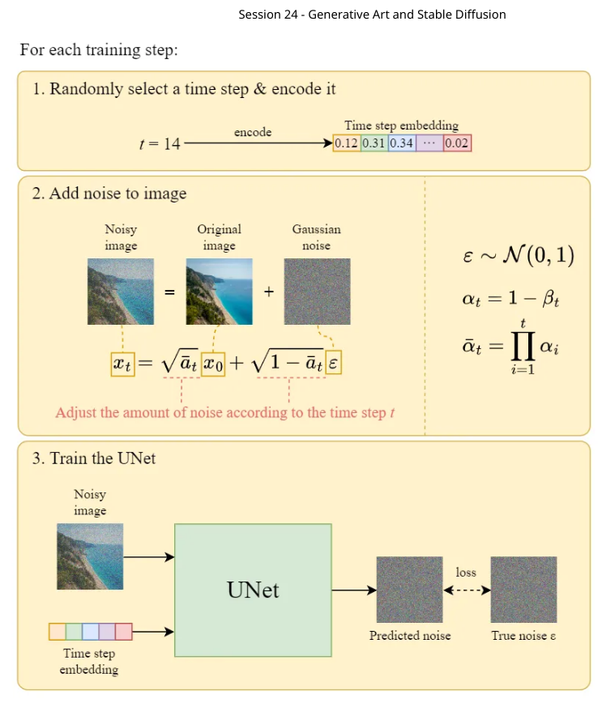
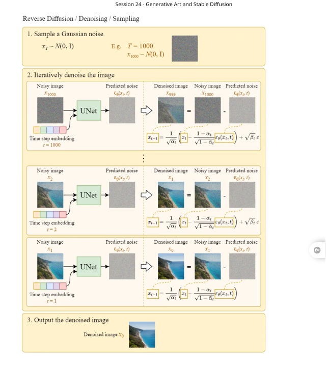
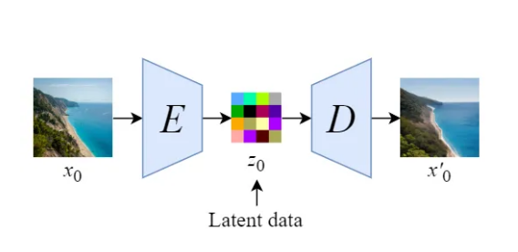
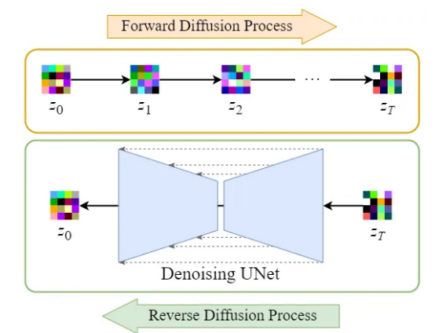
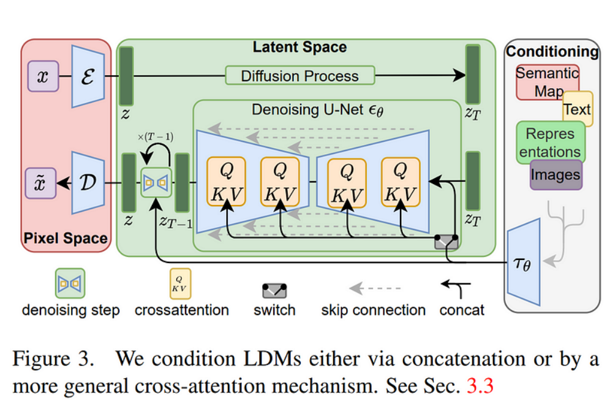
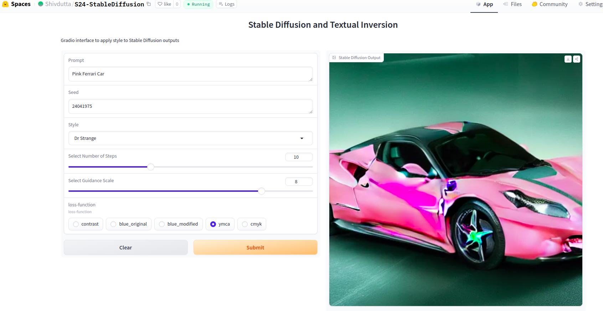
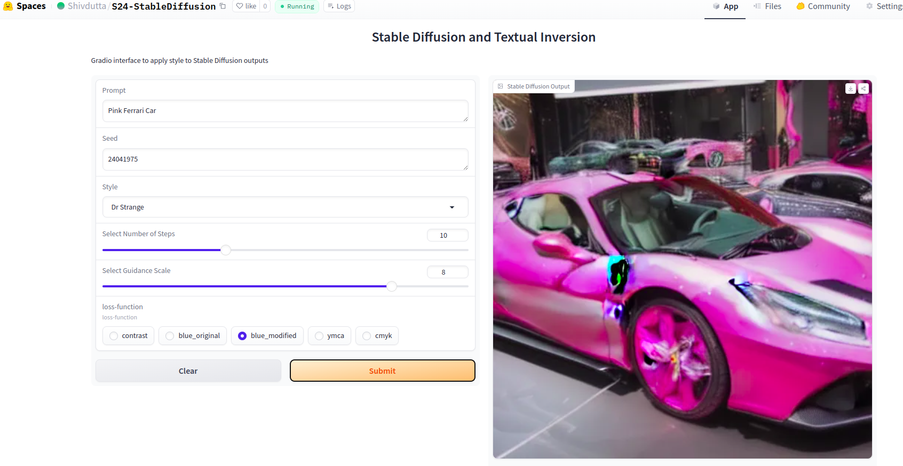

# Generative Art and Stable Diffusion

### Notes From Class:

### Notes on Generative Art and Stable Diffusion

**Introduction to Stable Diffusion:**
Stable Diffusion is a type of generative model that converts noise into images. The process involves adding noise to images and then training a neural network to predict and remove that noise, thereby recovering the original image. This denoising process is at the core of how Stable Diffusion functions. It is based on a broader category of techniques known as diffusion models.

**The Diffusion Process:**
The diffusion process in Stable Diffusion involves progressively corrupting data with noise until it becomes unrecognizable. The model is then trained to reverse this process, recovering the original data by denoising. This is done in steps rather than in a single operation, which makes the process more manageable and accurate.

The training process of a diffusion model can be broken down into four steps:
1. **Sample Generation:** Clean samples from the original data distribution are generated.
2. **Noise Addition:** Gaussian noise is added progressively to these samples to create increasingly noisy data.
3. **Denoising Function Learning:** A neural network is trained to recover the original data from the noisy data by minimizing the difference between the denoised output and the clean data.
4. **Score Estimation:** The gradient of the denoising function is used to estimate a score function, which helps in sampling new data points and other tasks.

**Latent Space and U-Net Architecture:**
Stable Diffusion works with high-resolution images, often starting with 512x512 pixel images. To make the process computationally feasible, the data is condensed using latent space representations. This is achieved using a U-Net architecture, which compresses the data and then expands it back into an image. The U-Net serves as the backbone for the denoising process, predicting the noise that needs to be removed from the latent space to recover the image.

The process is iterative:
- A noisy latent vector is passed through the denoiser.
- The predicted noise is subtracted from the latent vector.
- This process repeats, gradually reducing the noise until the latent vector is clean enough to decode into an image.

**Text Guidance with CLIP:**
Stable Diffusion is not just about recovering images but also about generating images based on textual descriptions. This is where CLIP (Contrastive Language-Image Pretraining) comes into play. CLIP encodes both text and images into vectors that can be compared. In the context of Stable Diffusion, the textual description is encoded using CLIP and then used as a guide during the denoising process. This allows the model to generate images that match the given text prompt.

**Stable Diffusion Model Architecture:**
Stable Diffusion differs from standard diffusion models by operating in a lower-dimensional latent space instead of pixel space, which reduces computational demands. The model consists of three main components:
1. **Autoencoder (VAE):** This compresses the image into a latent vector and decompresses it back into an image.
2. **U-Net:** This performs the denoising in the latent space.
3. **Text-encoder (CLIP):** This encodes the text inputs to guide the image generation process.
                              

**Conditioning and Cross-Attention:**
Conditioning is crucial in Stable Diffusion for generating images based on specific prompts. The model is conditioned on text inputs by augmenting the U-Net with cross-attention mechanisms. This allows the model to focus on specific parts of the latent space that correspond to the text input, ensuring that the generated image aligns with the prompt.
The cross-attention mechanism works by integrating the text-encoded vectors from CLIP into the U-Net, enabling the model to pay attention to the relevant features in the latent space that match the text description.

**Sampling with Stable Diffusion:**
Once the model is trained, the actual image generation (sampling) involves starting with pure noise and iteratively denoising it to produce an image. This sampling process is guided by the learned score function, which helps in navigating the latent space to find the image that best matches the input text.

**Comparison with Traditional Diffusion Models:**
Stable Diffusion is more efficient than traditional diffusion models because it operates in the latent space rather than pixel space. This not only speeds up the denoising process but also reduces memory usage, making it more practical for high-resolution image generation.

**Conclusion:**
Stable Diffusion represents a significant advancement in generative models by combining the strengths of diffusion processes with efficient latent space operations and powerful text-image alignment via CLIP. It is particularly well-suited for generating high-quality, high-resolution images based on detailed textual descriptions, making it a powerful tool in the field of generative art.

### sd-concepts-library

- The SD-Concepts Library is an innovative repository designed for users of Stable Diffusion, a state-of-the-art deep learning model primarily used for generating high-quality images from   text prompts. This library serves as a central hub for storing, sharing, and accessing custom concepts that can be integrated into Stable Diffusion models, enabling users to create  highly personalized and unique images.

- The SD-Concepts Library is essentially a collection of pre-trained embeddings, models, and configurations that can be used to enhance the capabilities of Stable Diffusion. These concepts range from specific art styles, character designs, and objects to more abstract ideas like emotions or moods. By incorporating these concepts into their projects, users can significantly expand the creative potential of Stable Diffusion, allowing for the generation of images that are more aligned with their artistic vision or project requirements.

- The SD-Concepts Library, combined with text inversion, enhances Stable Diffusion's image generation capabilities by allowing users to integrate custom concepts and reverse-engineer images into text prompts. This powerful tool enables precise, creative, and personalized visual outputs, making it invaluable for artists, designers, and AI-driven creative projects.

This Gradio repository contains following files:

- `app.py`: Code for image generation using sd-concepts-library with prompt , steps and guidance

## Output

